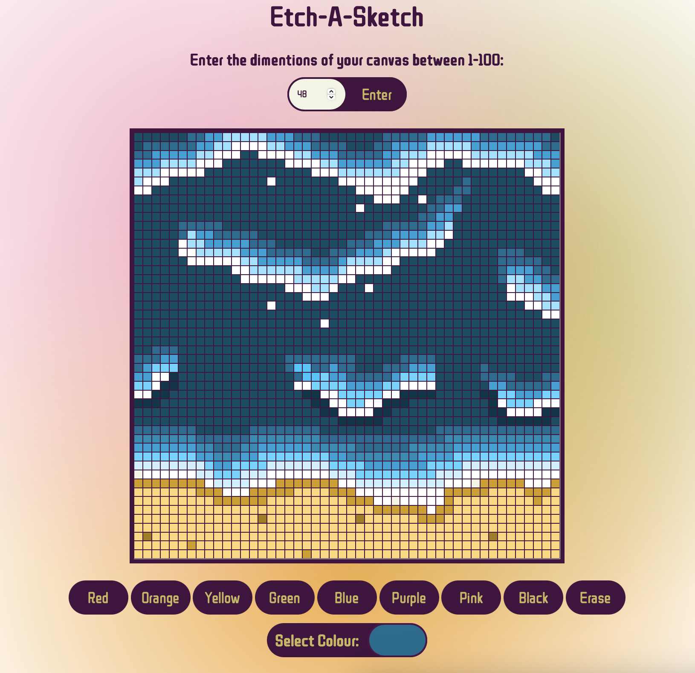

# Etch-a-Sketch

This is a browser-based Etch-a-Sketch style app where the user can control the size of the pixels. The user enters any number between 1 and 100 to set how many pixels run along one row of the canvas. Users can then draw by moving their mouse over the pixels.

## How It Works

- User selects how many pixels they want
- Pick a color
- Mouseover event listener allows the user to start drawing on the canvas
- Click to draw, click again to stop drawing or leave the canvas area
- Reset or erase

## Why I Made It

For fun and to view my progress.

Overall, it’s a quick HTML/CSS/JS experiment to mess around with the DOM and event listeners.

This project took me months to complete when I started coding.

## Tech Used

- HTML
- CSS
- JavaScript

## How To Run

- Open terminal (where index.html is)
- Run: npx serve
- Enter a pixel size, pick a color, and start drawing :D

